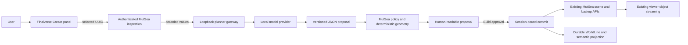
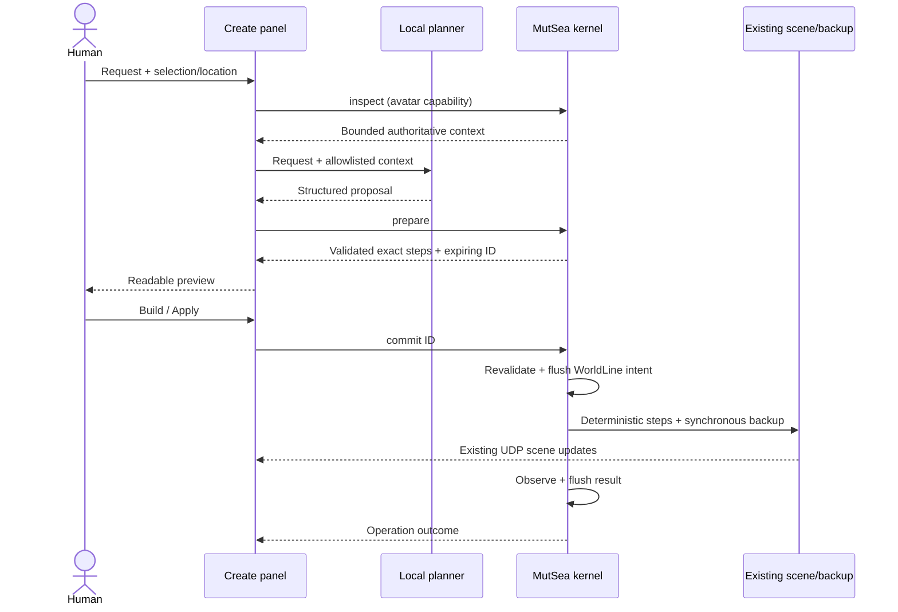

# Implemented AI world architecture (Phase 2)

Finalverse adds `LLFloaterFinalverseAI`, a C++/XUI Create panel, and requests the `FinalverseWorld` Seed capability. MutSea adds the opt-in `Finalverse.World` region module. A separate development planner lives at `~/Finalverse/services/ai-gateway`. Existing login, streaming, renderer, scene graph and simulator persistence remain authoritative.

The planner holds no simulator capability or login credential. Server capability registration binds the authenticated avatar and current region session. Prepared plans expire after two minutes and are invalidated on capability-session replacement. The viewer rejects stale asynchronous replies after cancellation or region changes. Mutation cancellation is disabled after dispatch because a sent commit may already have applied.

The gateway uses a small provider protocol, native Ollama structured output, schema validation and a context allowlist. Read questions use an empty-action schema; explicit relative moves and home requests narrow available tools. It retains the nearest eight entities plus up to four request-relevant references, together with selection and avatar/terrain context. The model chooses entity IDs and parameters. Trusted code computes relative movement, foundation elevation and the 17 home primitives. No template response is presented as live AI.

MutSea validates ownership, simulator permissions, physical/link/inventory restrictions, UUIDs, finite values, dimensions, region bounds, proximity and budgets. Creation also checks a conservative rotated footprint against all existing objects and terrain samples; an intervening scene change invalidates the proposal. API edits reuse existing scene insertion, transforms, deletion, update scheduling and synchronous backup.

Clearance uses inherited group bounding boxes, including linked children, plus a conservative primitive radius. Clone/delete/restoration exclude advanced geometry, texture/material features, flags and changed generated permissions. The panel discards a proposal when its preview is replaced and displays IDs and exact before/after values. Model context omits full descriptions/rotations and credentials.

Transactions use durable intent, preconditions, deterministic execution and compensation. They are not ACID across the simulator database and WorldLine file, and ordinary legacy edits do not share the module lock. Interrupted/unrecoverable operations lock further AI writes until administrator recovery.

Lumi is a persistent semantic identity with a home relationship and simple creation memory. There is no Lumi avatar, autonomous navigation, voice, visitor memory or society implementation. A future citizen runtime can consume these relationships.

Structured simulator logs correlate actor/region, operation, status, latency, plan/operation IDs and outcome without bearer URLs, prompts or scene labels. WorldLine holds the private detailed provenance. The local planner logs its request ID/provider/latency/action count separately; distributed tracing and signed model provenance remain open.
