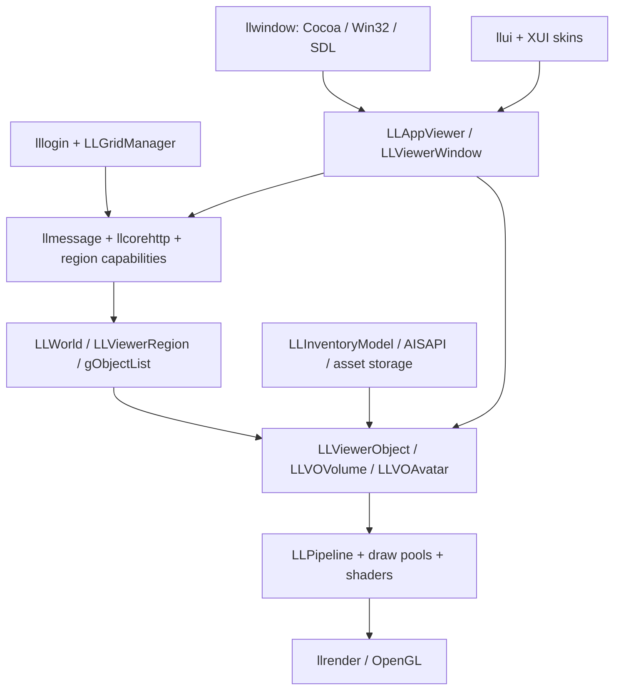
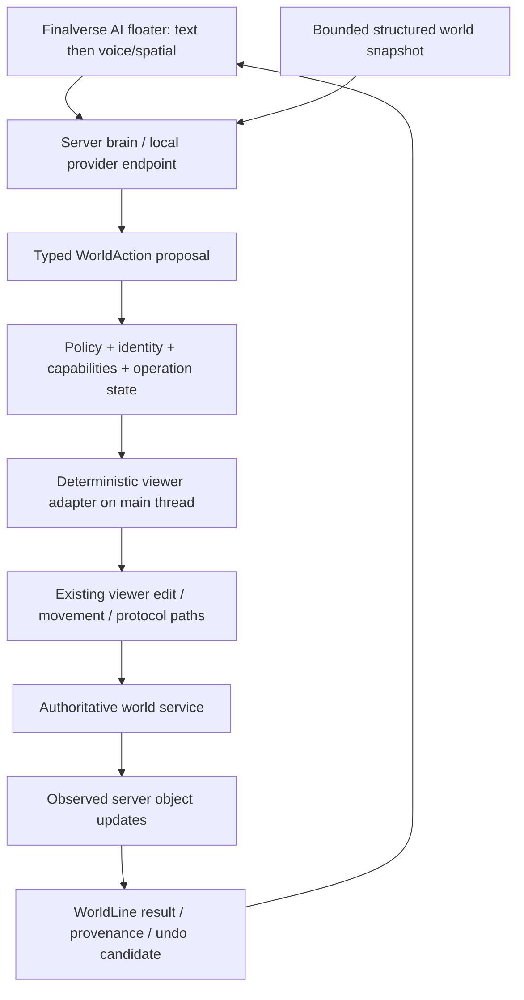

# Finalverse architecture: Phase 0

Current direction (2026-10-08): [MutSea spatial platform](mutsea-platform.md) separates canonical runtime, consumer experience and authoring. The following remains the Phase 0 source audit. Phase 2 now executes authorized world operations in the server module; Phase 3 adds the separate persistent citizen runtime; [Phase 4A](ux/phase4a-validation.md) supplies the verified desktop facade. Proposed viewer-side execution below is historical and is superseded by the implemented authoritative MutSea path.

Audit date: 2026-10-07 (Asia/Shanghai). Source baseline: `218de297a4a2cc286aba54e5df40e5e9e69caf43`, branch `contribute`, repository `finalverse/final_viewer`.

## Existing runtime

The executable is `secondlife-bin`, aggregated by target `viewer`; its application and most runtime integration live in `indra/newview`. CMake library boundaries already exist but do not form a portable headless world kernel. Global `gAgent`, `gAgentCamera`, `gObjectList`, `gInventory`, the `LLWorld` singleton and renderer `gPipeline` connect UI, networking, scene and presentation.

This describes the audited source, not an implemented Finalverse architecture. The viewer streams a partial replica of a simulator-owned world. `LLWorld` is nearby loaded regions, not all persistent world state. Local drawable deletion or object creation is not a persistent server operation.

## Proposed additive boundaries

`finalverse-contracts`: versioned values and schemas, no UI/GL/viewer pointer types. `finalverse-core`: policy evaluation, action validation, operation lifecycle and semantic sidecar interfaces. `finalverse-viewer-adapter`: the only module allowed to access legacy globals and viewer objects. `finalverse-ai-ui`: existing LLUI floater integration. `finalverse-brain`: service-side provider routing, orchestration and privileged secrets. `finalverse-worldline`: append-only operation records behind a storage interface. These are proposed names; none are build targets at Phase 0.

Keep C++ for the first client seam to reuse mature implementations. A Rust service can be evaluated separately; there is no justification to add a C++/Rust FFI boundary to the desktop MVP. Later mobile consumers use explicit wire schemas or a narrow C ABI, not STL or `LLViewerObject*` across language boundaries.

## Invariants

AI providers emit proposals only. Identity, resolved UUID, world/grid namespace, permissions, expiry, action scope and bounds are checked by trusted code at execution time. Scene labels, descriptions and chat are untrusted data. Existing edit operations stay authoritative through the simulator; packet transmission does not prove commit. Query responses state loaded-region coverage and missing/stale fields. Never silently widen a target from an entity to a whole linkset or to current UI selection.

The first mutation is a bounded move of a user-owned non-physical root object within its current region. Delete, purchases, script execution, inventory transfer and region-wide edits remain out of the initial action allowlist. Undo is a new authorized compensating action, not an assertion of server-side atomic rollback.

## Networking architecture

`LLGridManager` holds grid metadata, protected Second Life system login URLs and user-grid definitions. `LLLogin` in `viewer_components/login` performs event/coroutine-driven XML-RPC authentication; `LLStartUp` integrates the result into the viewer session and simulator connection. `LLViewerRegion` obtains Seed capability endpoints and per-region capability maps; `EventQueueGet` carries asynchronous service events. `LLMessageSystem` implements template-based simulator messages, circuits, acknowledgements and reliable UDP sends. `llcorehttp` handles HTTP assets/services through worker queues and completion delivery. Session/agent identifiers and capability URLs are credentials, not AI world context.

A Finalverse World API must sit above this protocol lifecycle. It must not replace grid login or assume all grids expose identical capabilities. Region crossing changes caches, local IDs and endpoints. Simulator authority is retained; physical collision/ownership changes are not solely client-side state. Voice already has `LLVoiceClient`, WebRTC and Vivox implementations; preserve human communication while evaluating model speech separately.

Evidence: [grid manager](../../indra/newview/llviewernetwork.cpp), [login](../../indra/viewer_components/login/lllogin.cpp), [startup](../../indra/newview/llstartup.cpp), [capabilities](../../indra/newview/llviewerregion.cpp), [message system](../../indra/llmessage/message.h), [HTTP](../../indra/llcorehttp/CMakeLists.txt), [voice](../../indra/newview/llvoiceclient.h).

## Scene and object architecture

`LLWorld` contains loaded/active/visible regions, not the persistent universe. `LLViewerObjectList` receives full, compressed, cached and terse updates and resolves UUIDs. `LLViewerObject` provides parent/child transforms, region/global/agent coordinate conversion, ownership flags, primitive materials and inventory hooks, but also drawable/GL state. `LLVOVolume` handles mesh/primitive geometry; avatar, terrain, water and particle specializations retain their own lifetimes. `LLDrawable` and spatial partitions/octrees connect those objects to culling and picking.

Object UUID and world namespace are semantic identity; simulator local IDs are transport identifiers. Read adapters project values after main-thread lifecycle checks. Write adapters reuse `LLPanelObject` validation and `LLSelectMgr` messages. Setting a local transform or killing a cached object alone does not guarantee a persistent world operation. Selection affects root/linkset targeting and editable faces; an AI executor cannot simply operate on whichever selection happens to be current.

## Avatar architecture

`LLVOAvatar` combines `LLAvatarAppearance` and `LLViewerObject`; `LLVOAvatarSelf` specializes the logged-in avatar. `LLAvatarAppearance` derives from `LLCharacter`, which owns joint/motion control through `LLMotionController`; `llcharacter` supplies keyframes, poses, gestures and inverse-kinematics helpers, while `llappearance` handles wearables, visual parameters and texture layers. `LLAgent` owns user movement/autopilot/animation requests; `LLAgentCamera` owns follow/focus/camera state. Remote avatars are replicated entities, not locally authorized agent accounts.

Preserve avatar streaming, animation, attachments and appearance. The first AI navigation wraps own-avatar autopilot and its completion event. Independent persistent AI characters require world-server identity, agent bindings and lifecycle authority. A viewer camera move cannot substitute for avatar navigation.

Evidence: [avatar](../../indra/newview/llvoavatar.h), [self avatar](../../indra/newview/llvoavatarself.h), [appearance](../../indra/llappearance/llavatarappearance.h), [character](../../indra/llcharacter/llcharacter.h), [movement](../../indra/newview/llagent.h), [camera](../../indra/newview/llagentcamera.h).

## Inventory and assets

`llinventory` provides inventory/permission/parcel/settings values. `LLInventoryModel` is the viewer cache/observer hierarchy and supports descendant filtering; background fetch and AIS inventory capabilities fill missing data. `AISAPI` supplies asynchronous create/update/fetch/remove inventory operations. `LLViewerAssetStorage` integrates asset transfer and HTTP fetch; `LLTextureFetch`/texture cache handle texture streaming; `LLMeshRepository` handles meshes/upload/cost/decomposition; glTF/PBR assets have material lists/loaders and editors. Inventory item identity, asset identity and rezzed world-object identity are distinct.

The World API should search a bounded user-authorized inventory view and reuse the existing rez/upload paths. Missing cache entries are unknown, not absent inventory. Do not export mesh/textures or complete inventory to AI providers merely because the client can render them. No-copy, transfer and upload-cost behaviors must remain visible and policy-controlled.

Evidence: [inventory model](../../indra/newview/llinventorymodel.h), [AIS](../../indra/newview/llaisapi.h), [asset storage](../../indra/newview/llviewerassetstorage.cpp), [texture fetch](../../indra/newview/lltexturefetch.cpp), [mesh repository](../../indra/newview/llmeshrepository.cpp).

## UI architecture

`llui` provides `LLView`, panels, controls, floaters, menus, notifications, inventory/tree widgets and XML construction. `LLUICtrlFactory` instantiates XUI-defined controls. `LLViewerFloaterReg` binds named floaters to code and `skins/default/xui` files; locale-specific skins/strings and `LLControlGroup` settings supply desktop UI/configuration. `LLViewerWindow` routes input, focus, picking and rendering. CEF is media/login content integration rather than the root desktop UI framework.

An additive LLUI Finalverse AI floater is the shortest maintainable desktop UI seam. Preserve chat, inventory, camera/editor tools and keyboard behavior. Native SwiftUI/Compose mobile surfaces consume shared contracts later; they do not inherit the desktop widget tree.

Evidence: [UI build](../../indra/llui/CMakeLists.txt), [floater registry](../../indra/newview/llviewerfloaterreg.cpp), [window](../../indra/newview/llviewerwindow.cpp), [XUI](../../indra/newview/skins/default/xui).

## Evidence

- [Root CMake](../../indra/CMakeLists.txt): libraries and viewer target.
- [Frame loop](../../indra/newview/llappviewer.cpp), `LLAppViewer::doFrame`.
- [World scope](../../indra/newview/llworld.h), region lifetime.
- [Object update path](../../indra/newview/llviewerobjectlist.cpp).
- [Existing event operations](../../indra/newview/llagentlistener.cpp).
- [Editing and send path](../../indra/newview/llselectmgr.cpp).

See [world-api.md](world-api.md), [semantic-world-model.md](semantic-world-model.md), [ai-architecture.md](ai-architecture.md) and [decision-log.md](decision-log.md).
