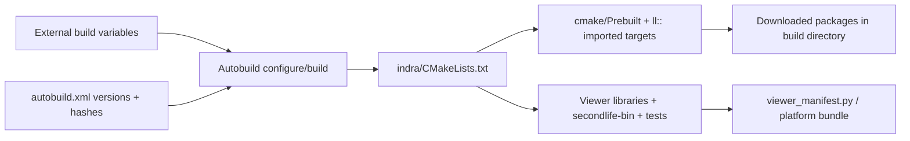

# Existing build system and dependency flow

## Source evidence

`indra/CMakeLists.txt` is the root (CMake >=3.16, C++20). `autobuild.xml` supplies common/platform configurations, prebuilt dependency versions and archive hashes. `build.sh` is CI orchestration with externally supplied functions/environment, not a simple portable standalone build command. `indra/cmake/Variables.cmake` requires `LL_BUILD`; a separate build-variables file supplies flags. That external file is untracked in the existing checkout and must be pinned/hash-recorded.

`Prebuilt.cmake` invokes `autobuild install` for packages during configuration. A supported Conan path is conditional on an optional generated `conanbuildinfo` file; no checked-in dependency-closed mobile/core build is supplied. Do not substitute global Homebrew libraries for prebuilt packages without ABI/link review.

## Platform configurations

macOS uses Xcode generation and `build-darwin-x86_64`; Windows uses Visual Studio/MSBuild and `build-vc${AUTOBUILD_VSVER}-64`; Linux uses Ninja and `build-linux-x86_64`. Common `Release`/`RelWithDebInfo` enable proprietary dependencies; `ReleaseOS`/`RelWithDebInfoOS` disable them. Use the open configuration with OpenJPEG and physics stubs for the baseline. `LL_TESTS` defaults OFF; Linux manifest configurations also set it Off explicitly. Enable it for test verification.

Unit tests are generated custom targets and success stamps; integration tests run as POST_BUILD commands. CTest registration is commented out in `LLAddBuildTest.cmake`. A `ctest` invocation finding no tests would not prove a passing suite.

Packaging and app resource copying run via `newview/viewer_manifest.py` and CMake targets. Signing, notarization, updater and crash service configuration are distinct release gates. Do not activate inherited release/upload jobs simply to build locally.

## CI audit

The inherited build workflow has Windows/macOS runners, Python 3.11, Autobuild/build-variable and master-message-template dependencies, secrets for private constituents and separate signing/release machinery. It does not establish Linux/ARM/mobile CI verification for this fork. The added `sync_upstream.yml` targets `main` and performs automated pushes, while the local branch is `contribute`. That mismatch and unreviewed push automation are release governance risks; this audit did not edit or execute the workflow.

## Reproduction

See [upstream-baseline.md](upstream-baseline.md) for exact attempted commands, tool versions, log artifacts and observed result. A clean source checkout alone is not a reproducible full build: compiler/SDK, external flags, Python packages and dependency archive availability must also be recorded. Baseline changes must be reported as build-enablement changes rather than silently called an untouched upstream success.
