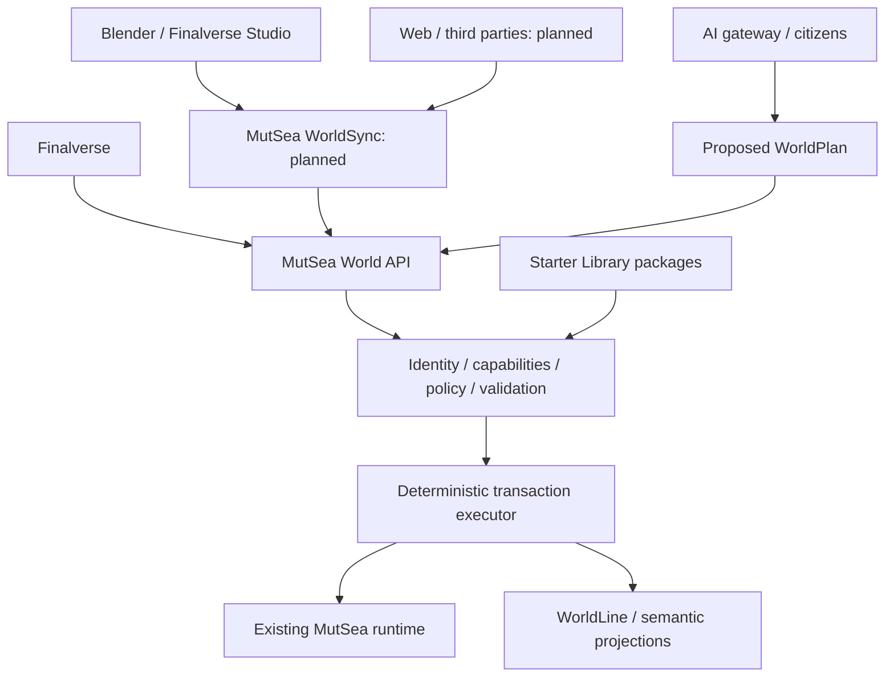

# MutSea spatial platform direction

Decision: 2026-10-08. MutSea is the AI-native spatial platform and canonical runtime; Finalverse is its flagship consumer experience. This document distinguishes the running development slice from the target platform.

## What exists

MutSea retains inherited identity, inventory, assets, avatar appearances, region simulation, object permissions, scene persistence and UDP/capability delivery. The separate opt-in `Finalverse/World` module adds bounded inspection, proposals, validation, deterministic execution, guarded compensation and private WorldLine. The local AI gateway proposes plans and the Rust citizen runtime persists one Lumi identity, memory and goals. The Finalverse viewer remains a streamed replica and presentation/interaction client. These are development services, without public registration or production governance.

## Product boundaries

| Product | Responsibility |
|---|---|
| MutSea | Authoritative spatial runtime and platform contracts |
| Finalverse | Consumer world, social interaction and AI creation experience |
| Finalverse Studio | Authoring representations and review; initially Blender plus external tools |
| MutSea Starter Library | Versioned, composable, semantic starter content |
| MutSea Cloud / Hub / SDK / Enterprise | Future managed hosting, content distribution, integration and governance |

MutSea owns canonical entity IDs, transforms, permissions, semantics, relationships, runtime/agent state, versions and WorldLine. Blender owns editable authoring representations. Asset/template IDs identify published definitions; instantiated entity IDs identify persistent world objects. Cloning a template creates new instance IDs. Renovating existing Harbor preserves existing IDs and bindings through an explicit migration. No editor, AI provider or package gains authority by supplying an ID.

## Starter content contracts

Definitions compose as asset → prefab → building → place → neighborhood → community → city → world. Categories are descriptive; they do not grant privileges. The package manifest must declare an immutable ID/version, title, publisher/author, license and provenance, dependencies pinned to exact versions and hashes, payload hashes, semantic entities, bounds and performance budgets. Missing rights or semantics prevent publish/provision validation. Unknown formats are rejected rather than executed.

`WorldTemplate` adds terrain, environment, spawn points, scene and semantic graphs, default agents/experiences, permissions and client requirements. `AvatarTemplate` specifies compatible skeleton/body, required appearance slots, outfits, inventory/attachment dependencies and readiness checks. `OutfitTemplate` binds wearable/attachment slots to assets without copying inherited rights. `AssetPackage` contains reusable content; `ExperiencePackage` composes a world, agents, workflows, declared integrations and policy. Scripts/UI extensions/integrations require separately reviewed allowlists; package metadata is never executable code.

Account provisioning is a recoverable state machine: identity pending → inventory/body/outfit provisioned → asset/dependency validation → persistent appearance written → ready. Failed steps remain pending with actionable diagnostics and idempotent retry; they must not be announced as successful registration. Existing operator account creation currently does not provide this guarantee. Community provisioning similarly validates a template and plan before authorization, then records an instance mapping and receipt. Cross-service atomicity is a future engineering requirement, not a property of the current file/database executor.

## Planned platform modules

| Boundary | Scope | Earliest phase |
|---|---|---|
| Content contracts + validator | Definitions, hashes, semantics, rights, budgets | 4B content pipeline |
| Starter provisioning adapter | Inventory/appearance readiness and world instantiation using inherited services | 4B.1 |
| Community / Organization | Membership, roles, worlds, policies, branding and governance | 5A |
| WorldSync | Editor-neutral snapshots, revisions, preview/commit, conflicts and asset changes | 5C |
| Hub / SDK | Versioned distribution, API clients, webhooks and creator tooling | 5D–5E |
| Spatial commerce | Product/merchant/catalog graph and explicitly authorized purchase adapters | 5F |

WorldSync must carry authenticated actor/session context, world/entity revisions, idempotency keys and correlated receipts. Planned messages include HELLO, SUBSCRIBE, SNAPSHOT, PREVIEW, COMMIT, ROLLBACK, CONFLICT and asset/semantic updates. CREATE/UPDATE/DELETE are proposed operations routed through policy, never a bypass. Locks are bounded authoring leases, not ownership. Rollback remains guarded compensation unless storage supports stronger transactions. WorldSpec, branching/diff/merge and bidirectional live editing are target capabilities, not shipped endpoints.

## Delivery order

4B creates attractive, reusable Harbor/avatar/content and verifies appearance, identity, performance and regressions in the viewer. 4B.1 makes validated starter content and recoverable account/community provisioning product capabilities. A 3–5-person first-time study follows before 4C public acquisition. Phase 5 expands communities, templates, WorldSync, creator hub, SDK, commerce, enterprise and creator economy only after the acquisition loop is validated. Preserve the current renderer and Phase 4A facade throughout.
