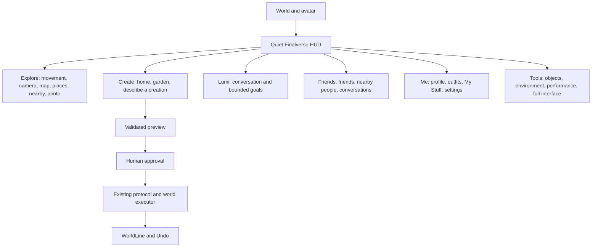

# Information architecture

The product journey is curiosity → beauty → emotional connection → interaction → creation → social connection → return. The first five minutes should move through those experiences, without requiring mastery of inherited terminology.

`LLPanelFinalverse` provides the HUD. `LLFloaterFinalverseExperience` provides pages; it delegates to the registered LLCommandManager callbacks and existing people panels. All six experience pages share one floater instance; page names are navigation state rather than registry identities. Closing the panel after switching pages closes the entire facade window. `LLFloaterFinalverseAI` owns the existing capability/HTTP flow. `llfinalversePlanSummary` formats validated steps deterministically.

Normal, Creator, and Developer are levels of disclosure, not separate copies of the runtime. Normal exposes the five HUD entries. Tools exposes creator facilities and a Full interface option. That option restores menus/status/navigation and configurable toolbars. Back to Finalverse restores the compact facade. The setting `FinalverseExperienceEnabled` persists this choice. No inherited inventory, social, editing, camera or diagnostic subsystem is removed.

The fullscreen HUD holder is transparent to world input except for its compact surfaces. It sits behind floaters. Existing stand/stop-flying controls and conversation infrastructure retain their containers. The facade refreshes local region/selection state twice a second; it does not query a provider or backend on a timer.

Select activates the existing inspect picker. The HUD retains a native `LLObjectSelectionHandle` while the contextual card owns the selection, releases it on Clear or Full interface, and lets normal native cleanup continue. Normal touch, sit, media and movement clicks retain their existing behavior.
