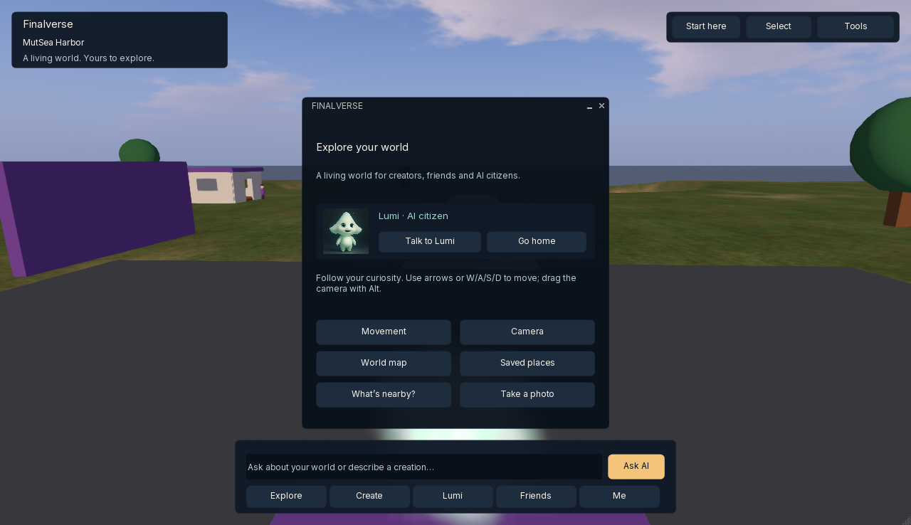
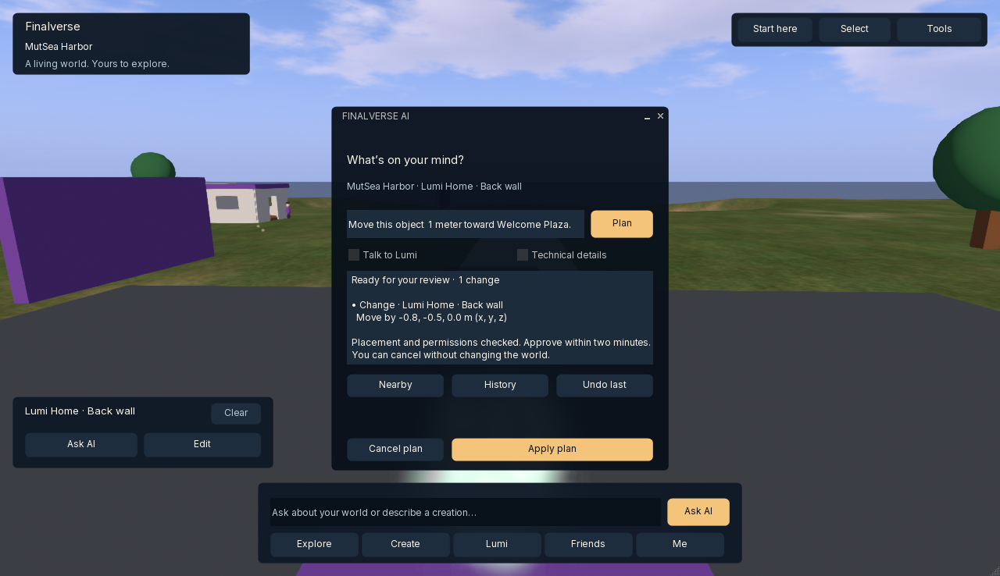

# Phase 4A validation — 2026-10-08

The macOS facade is implemented and its supported development workflows have been exercised in the actual packaged viewer. This is an engineering acceptance result, not a new-user study or a production-release certification. Harbor remains a primitive proof world; the supplied illustrated Harbor is an art direction reference.

## Starting and ending state

| Repository | Starting commit | Ending state |
|---|---|---|
| Viewer | `7ad89595d35b8e3470a9fda821691017ec6f13be` | Phase 4A local milestone on `codex/experience-facelift` |
| MutSea | `e7cd5f9b27f09ec2dba7dbe46072ed54bc7ce5c7` | Unchanged |
| AI gateway | `4dc29c16e5a39da5baa8662c1626ae593c436e3a` | Unchanged |
| Agent runtime | `1047793eac1156f4493b3d1a27d1d4b9f3970942` | Unchanged |

The viewer's Phase 3 branch remains at the starting commit. Published viewer main `a285e04d5de0515034286e7bc7e2c5cba6676abf` and MutSea main `0c9e8756d05c2820deeda4c0c0d5bb8c30bb4a22` are preserved. Exact pre-edit branches, commits and NUL-delimited status hashes for seven checkouts were recorded privately. The original viewer's 9,332 dirty entries and the branding worktree's 27 dirty entries are outside this change. No source changes were made to either or to the services. No push is part of this milestone. Resolve the viewer ending commit with `git log -1` on the facelift branch; its hash is also included in the external handoff record.

## Architecture and implemented components

`LLPanelFinalverse` adds a compact world HUD behind floaters, with region identity, a command editor, Explore/Create/Lumi/Friends/Me, Start here, Select and Tools. It retains the native selected-object handle while the contextual card owns it. The holder otherwise passes world input through. The existing toolbar container remains alive for stand, stop-flying and conversation infrastructure.

`LLFloaterFinalverseExperience` provides one reusable six-page window and a shared Lumi card. Buttons delegate to existing LLCommandManager callbacks or native people panels. Full interface restores advanced chrome; Back to Finalverse restores the facade. `FinalverseExperienceEnabled` is a reversible saved preference.

The existing `LLFloaterFinalverseAI` presents region/selection context, factual activity stages, validated human previews and optional Technical details. Both command editors submit only on Enter or their explicit action buttons. Apply checks that the selection still matches the prepared plan. Citizen garden approval requires a displayed prepared proposal. Existing capability authentication, gateway proposal, server policy, deterministic execution, WorldLine and guarded Undo remain the mutation path.

`llfinalversePlanSummary` formats actual movement deltas, dimensions, names and destructive steps; every deletion stays visible even when a long recipe abbreviates other rows. Raw identifiers/provider output remain in Technical details for actionable previews. Five unit cases cover presentation and the optional-grid-benefits compatibility seam.

Semantic colors, bundled Inter typography, existing Rounded_Rect textures and the existing licensed Lumi portrait supply the visual system. Registration, CMake, LLViewerWindow initialization and main-view XUI are the integration seams. Two inherited grid seams suppress a false vendor-benefits notice when a non-system grid does not advertise that service and give neutral empty-friends guidance. System-grid and advertised-invalid benefits failures remain visible. Renderer, protocol, fonts and server branding remain intact.

## Build and automated checks

Machine: MacBookPro17,1, Apple M1, 16 GiB RAM, macOS 26.6.2 (25G83). The Xcode/Clang build produces a universal ARM64 + x86-64 executable; actual runtime checks here use native ARM64.

| Check | Result |
|---|---|
| RelWithDebInfoOS universal build | Passed; final `build-navigation-retry.log` ends BUILD SUCCEEDED |
| CTest | 116 groups passed, zero failed, 102.41 seconds |
| TUT cases inside those groups | 1,282 total; 1,273 passed; nine inherited known failures skipped |
| New finalverse_presentation group | Five cases passed |
| Python manifest tests | Eight passed |
| Final actual-package branding/provenance checks | Seven check categories passed |
| Packaged XUI versus source | HUD, experience, AI and people XML byte-identical; single_instance enabled |
| Diff whitespace | Clean |

The nine existing skips concern pthread cancellation (two), HTTP assertions (three), LLTrace texture statistics, flaky LLHost, architecture-sensitive math comparison and a cross-thread hang. They are not new passes. The full test run predates the last page-navigation-only adjustment; the final build and live one-window/keyboard checks verify that adjustment. The unchanged Phase 3 service suites were previously 61 runtime, 38 gateway and 51 MutSea tests; they were not rerun or counted as new Phase 4A automated coverage.

Final test package: `~/Finalverse/dev/phase4a/Finalverse Experience.app`, identifier `com.finalverse.viewer.experience`. Final executable SHA-256: `9b95092856af5df6d2e6344d6b5fc6b3090b90ec66ccee14387395767a7cf1c5`. Build ID `262810010`; `LL_TESTS=ON`, `USE_OPENAL=ON`, `USE_VELOPACK=OFF`, channel Finalverse Test, pinned Python 3.13.6 tooling. See [local-development.md](../local-development.md) for build and launch commands.

One final linker attempt failed because the development disk filled. Removing only four redundant Phase 4A generated package backups and the incomplete lipo output allowed the retry to pass. The preserved Phase 3 app, source, profiles and persistent world data remain. The machine still has little free disk space; another full build/package may need space allocated before it starts.

## Actual viewer acceptance

The isolated MutSeaCitizens sandbox runs on loopback 18094, with the existing loopback gateway/runtime. Credentials, profiles, capability addresses, entity IDs, raw logs and receipts stay outside Git. Only safe screenshots are included here.

| Gate | Result and observed evidence |
|---|---|
| 1. Launch | Final copied package launched natively; four packaged facade resources match source |
| 2. Login | Existing private development account logged into the explicitly selected local grid |
| 3. Enter Harbor | Terrain, home, roads, trees, object updates and citizen embodiment rendered |
| 4. Basic controls | Arrows moved the avatar/camera; Explore shows movement and Alt-camera help; this does not prove a new user's understanding |
| 5. Identify Lumi | Named portrait/card and Lumi entry point visible; linked primitive embodiment observed and independently inspected |
| 6. Talk | Real citizen identity response received through the runtime; final package also opens the correct Send-mode draft without auto-submitting |
| 7. Nearby | Real capability inspection displayed eight nearby named objects |
| 8. Select | Native inspect picker produced a retained contextual card; Clear released it |
| 9. Ask to change | Selected home window produced a prepared one-meter movement proposal |
| 10. Preview | Human preview showed the target and actual delta; Technical details expanded exact states/model data and returned to normal view |
| 11. Approve | Apply enabled for the displayed validated world proposal; garden required separate visible approval |
| 12. See change | Home window visibly moved; three approved garden shrubs visibly appeared |
| 13. Undo | Window returned to its original position; garden shrubs disappeared; History recorded committed/undone operations |
| 14. Create | Home, garden and describe-creation entries visible; final navigation updates one window |
| 15. Friends | Native Friends tab opened with neutral grid guidance; Nearby People opened the correct tab/map and showed the local user |
| 16. Me / My Stuff | Profile route opened the development profile; My Stuff loaded 136 items / 42 folders. Some profile fields remain Loading in this sandbox |

The window movement was approximately (-0.9, -0.5, 0.0) m toward Welcome Plaza. A later Back wall preview, captured below, showed (-0.8, -0.5, 0.0) m and was deliberately not applied. Clearing selection before Apply produced “Your selection changed. Plan again for the current object.” and disabled Apply, with no visible world mutation. These are separate proposals, not inconsistent measurements of the same operation.

Additional regression checks: drafting in the HUD then clicking the world did not submit; Enter opened the AI once. Drafting in AI then expanding Technical details did not submit. Final Welcome → Tab → Tab → Return changed to Explore in the same window. Switching Create → Friends → Me and closing once left no stacked facade windows. Full interface restored inherited chrome and Back to Finalverse restored the HUD. Native screenshot export produced the unaltered PNG evidence below.

Text scaling: UIScaleFactor 1.25 was exercised at a 1942 × 1208 physical window. The 432 × 442 logical AI/experience windows fit after the layout repair, including Apply/Cancel/Undo. Me controls were also inspected at the maximized 2560 × 1540 physical window. The existing Settings scale control restored 1.00. The minimum declared desktop viewport is 800 × 450 logical px; smaller/mobile layouts were not tested. Focus borders and Tab activation were visibly checked. This is not a complete accessibility certification.

No new failure was observed in the checked movement, selection, inventory, social entry, approved world-edit or Undo paths after the fixes. Voice, multi-user invitations, arbitrary editing, every inherited menu and all other grids were not exhaustively exercised. Service restart/persistence code was unchanged; earlier Phase 3 restart evidence remains in [phase3-persistent-citizens.md](../phase3-persistent-citizens.md).

## Screenshots and provenance

Explore: native viewer PNG export at 1280 × 738, UI scale 1.00, 2026-10-08 19:12:59 Asia/Shanghai. Source file `explore-facade_2026-10-08_19125901.png`; final executable hash above. It shows the actual primitive Harbor and current avatar-cloud limitation.

AI preview: native viewer PNG export at 1280 × 738, scale 1.00, 2026-10-08 19:05:42 Asia/Shanghai. Source file `explore-facade_2026-10-08_19054201.png` (the inherited save base name is unrelated to its contents). Captured before the last navigation-only fix, executable hash `724ce829c7ec721a43ab16ed0e600da0e5c3d4ad66e9d7b02daf0e7a2c09f254`; its AI formatter/layout is identical to the final build. This proposal was not executed. Both PNGs were visually inspected and copied byte-for-byte, with no compositing or retouching. The portrait is the existing branded resource; no moodboard environment is represented as shipped.

## Performance measurements and limits

The opt-in `FinalverseUXMetrics` setting is off and non-persistent by default. It logs aggregate CPU time in HUD drawing and synchronous facade open calls. No continuous inference, blur, backdrop capture or animation was added. Idle context refresh reads local state at 2 Hz.

Measured one compact/full-interface pair in the same process, arrival camera, 2560 × 1540 physical window, scale 1.00, without open floaters, build work or model requests. Each 30-second interval contains six process CPU/RSS samples, six 300-frame HUD CPU averages and two settled ten-second FPS averages. Compact interval: 10:46:20–10:46:50 UTC. Full interface: 10:48:01–10:48:31 UTC. These intervals use the pre-navigation-fix binary; its HUD implementation is identical to the final build.

| Median measurement | Compact facade | Full interface |
|---|---:|---:|
| FPS, settled ten-second means | 59.25 | 58.30 |
| Main-process CPU, one-core percentage units | 58.7% | 61.9% |
| Main-process RSS | 222.50 MiB | 159.62 MiB |
| HUD wrapper CPU draw submission | 0.2943 ms | 0.0560 ms |

The full-interface HUD wrapper contains mostly the return button. These are whole-main-process CPU/RSS readings, excluding child processes, not isolated UI allocations. The 62.88 MiB RSS difference can reflect memory pressure, cache or allocator behavior; a single pair cannot establish retained UI memory overhead. Legacy chrome changes the world viewport. GPU execution cost was not isolated. No material FPS loss appeared in this sample, but a repeated controlled GPU/steady-memory study remains a release gate.

Final package open-call timings: first experience open 38.645 ms; subsequent page opens 3.200, 7.545, 1.824, 26.421 and 7.633 ms (median 7.545 ms). AI first open 25.023 ms; second open 8.149 ms. These include synchronous LLUI work up to opening/prefilling; they exclude first rendered-frame latency, network and model time. They are small samples, not percentile guarantees.

Private build/test logs, performance JSON, screenshots, profile and starting/ending state records live in the local Phase 4A evidence directory. They are not checked in because they may contain account/world identifiers or environment details.

## Remaining surfaces and risks

- Login/account creation, inventory internals, profiles/outfits, People lists, object editors, settings, camera/map panels, diagnostics, context menus and floater chrome remain inherited surfaces behind the facade.
- The current avatar still appears as a cloud because of the inherited sandbox appearance/asset path. Lumi's seven-part primitive body differs from the portrait. Scene, avatar, vegetation, water and lighting quality remain the largest visual gap.
- The local planner returned no actionable recoloring plan for attempted requests. Supported movement/home/garden operations passed; unrestricted generation, Follow and camera-projected AI context are future work.
- Citizen approval still needs atomic server binding to the displayed proposal across concurrent sessions before a public multi-controller release. The added UI guard is useful within the current single-controller MVP, not a distributed authorization fix.
- Inherited Velopack linkage produces a 15.5-versus-11.0 deployment-floor warning even with updater integration disabled. Signing, notarization, dependency entitlement and minimum macOS compatibility audits remain distribution gates.
- Universal compilation is not Intel runtime verification. Windows, Linux, mobile, public-grid deployment, voice and multi-user social verification remain outside this Mac milestone.
- The five-minute journey and retention sequence are product targets. No first-time participant study or return-rate measurement has been performed.

## Recommended next milestone

Use the preserved facade as the entry point for Phase 4B scene/avatar quality: fix reliable avatar appearance first, then replace proof primitives with a small licensed Harbor/home/garden asset set and a consistent Lumi embodiment, measuring streaming and frame cost. Keep asset licensing/provenance explicit. Before public rollout, close atomic citizen-approval and Mac distribution gates. Run a five-minute task study with new users before claiming the onboarding acceptance is complete for them.
