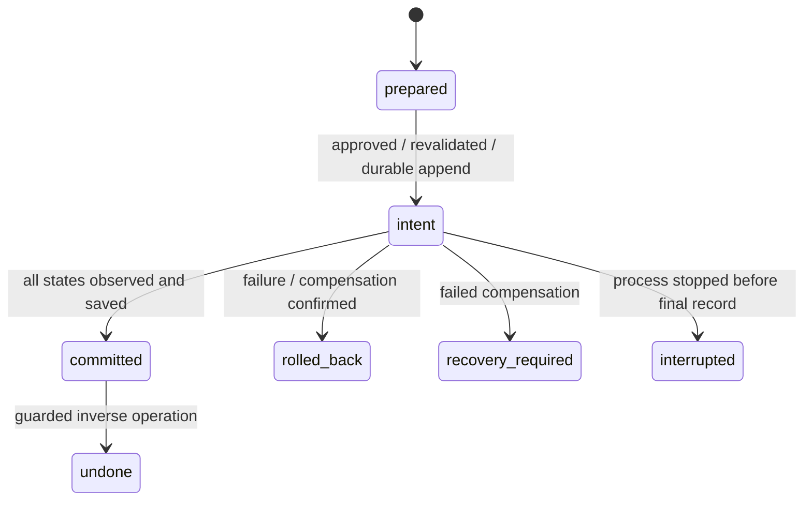

# WorldLine v1

MutSea writes one append-only `<region UUID>.worldline.jsonl` in the configured private data directory. Records contain operation/plan/actor IDs, timestamp, original request, provider/model claim, deterministic steps, before/after values, status, observed final state where available, errors and Lumi ownership. The file is flushed to disk before the first mutation and after the result. Unix directory/file permissions are restricted to the service user.

Successful primitives are synchronously backed up through the inherited simulator API before reporting commit. A crash can still occur between two durable stores. Startup refuses further AI writes for unresolved intents, recovery-required entries or malformed journals. It does not blindly replay destructive operations. Back up simulator data and WorldLine together; administrator recovery requires comparing every recorded target with live/database state and recording a reviewed recovery procedure. There is no automatic crash-repair or admin override API yet.

An audit write failure blocks further mutations. Compensation first compares each target with the expected applied state; a concurrent edit or partially applied object is preserved for explicit recovery rather than overwritten.

Undo checks current identity, ownership, permissions and transforms/attributes against expected state. If another editor changed an object, it refuses automatic compensation. Composite undo handles every component; direct deletion of a home component is blocked. Undo is not guaranteed when a permission change or concurrent legacy edit prevents compensation.

`journal` returns the actor's last 100 records. This development implementation loads its regional journal into memory at startup; indexing/retention, integrity signatures, collaborative branching and production scale remain open. Provider/model fields are caller assertions, not signed provenance.
